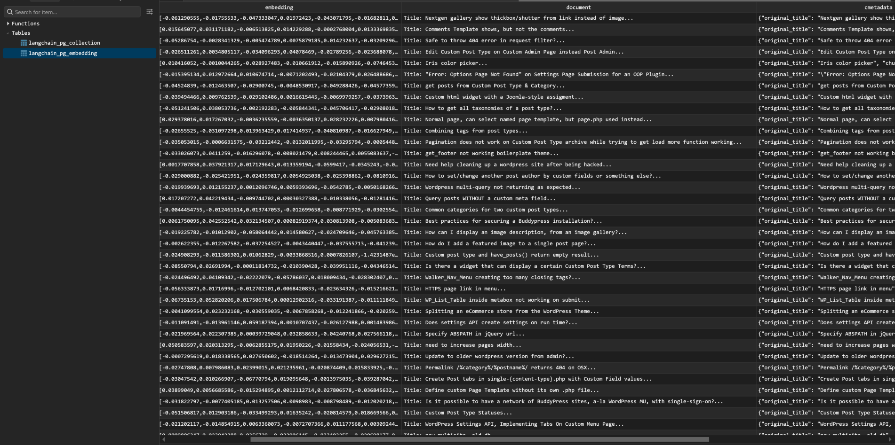
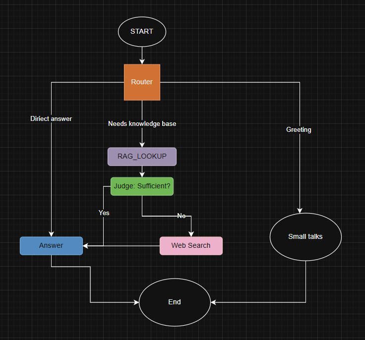

# AI Agent with RAG Retrieval Pipeline Challenge

Transform a WordPress QA dataset into a functional retrieval system with ingestion pipeline and retrieval capabilities.

## Configuration

Create `.env` file based on `.env.example`:

```bash
make env
```

Then set up your 
- [OPENAI_API_KEY](https://platform.openai.com/api-keys)
- [HF_TOKEN](https://huggingface.co/settings/tokens)
- [TAVILY_API_KEY](https://app.tavily.com/home)
- [LANGCHAIN_API_KEY](https://smith.langchain.com)

## Quick Start

```bash
# Setup
python3 -m venv .venv # Windows: python -m venv .venv
source .venv/bin/activate  # Windows: .venv\Scripts\activate
pip install -r requirements.txt

# Start database
make compose-up

# Download dataset
make data 

# Run ingestion
make ingest

# Run agent (interactive CLI)
make agent

# OR: Start REST API server
make server  # API at http://localhost:8000, docs at /docs

# OR: Start LangGraph Studio (for visual debugging)
langgraph dev  # Studio at http://localhost:2024

# Stop database
make compose-down
```

> **Note**: For LangGraph Studio setup and usage, see [docs/LANGSMITH_STUDIO_SETUP.md](docs/LANGSMITH_STUDIO_SETUP.md)

## Architecture

### Ingestion Pipeline

**Workflow**: `load_raw()` → `transform()` → `persist()`

1. **Load**: Reads `corpus.jsonl`, parses into `RawRecord` objects
2. **Transform**: Cleans text, validates records, chunks using LangChain `RecursiveCharacterTextSplitter`
3. **Persist**: Stores chunks and embeddings to PostgreSQL + pgvector via LangChain `PGVector`

**Key Features**:
- Smart text cleaning (preserves code blocks, markdown formatting)
- Batch processing (500 chunks per batch)
- Automatic schema creation and HNSW indexing
- Comprehensive error handling and progress tracking

Data after being cleaned, chunked and persisted to PostgreSQL + pgvector by the pipeline:


### Agent Architecture (LangGraph)

**Workflow**: Router → RAG Search → Judge → Generate Answer



The agent uses [LangGraph](https://langchain-ai.github.io/langgraph/) for orchestration with the following flow:

1. **Router Node**: Analyzes query intent
   - `direct_answer`: Simple greetings/chitchat → Direct response
   - `greeting`: Welcome messages → Direct response  
   - `needs_kb`: Technical questions → Proceed to retrieval

2. **RAG Search Node**: Retrieves relevant context
   - Vector search with PGVector (top-10 candidates)
   - Cross-encoder reranking (top-3 chunks)
   - Returns concatenated context

3. **Judge Node**: Evaluates context quality
   - Checks if context is sufficient to answer
   - `yes`: Use RAG context
   - `no`: Fall back to web search (Tavily)

4. **Generate Answer Node**: Creates final response
   - Uses OpenAI GPT-4o-mini
   - Context-aware generation with conversation history
   - Supports multi-turn conversations

**Key Features**:
- Conditional routing based on query intent
- Hybrid search (RAG + Web fallback)
- LangSmith tracing for observability
- FastAPI REST API endpoint

**Tracing & Debugging**: See [docs/LANGSMITH_STUDIO_SETUP.md](docs/LANGSMITH_STUDIO_SETUP.md) for LangGraph Studio setup

### Design Decisions

- **Embeddings**: OpenAI `text-embedding-3-small` (1536 dimensions) - computed by PGVector during persistence
- **Chunking**: LangChain `RecursiveCharacterTextSplitter` (1000 characters, 200 overlap) - ensure the context of the answer is not lost
- **Database**: LangChain PGVector - automatic schema/extension management

## Testing

```bash
# All tests
make test
```

# Server API Endpoints

```bash
make server
```

### POST `/chat`
Send messages to the agent and get responses.

**Request**:
```json
{
  "messages": [
    {"role": "user", "content": "How to install WordPress?"}
  ]
}
```

**Response**:
```json
{
  "response": "To install WordPress, you need to..."
}
```

### GET `/health`
Check API health status.

**Response**:
```json
{
  "status": "healthy",
  "agent_initialized": true
}
```