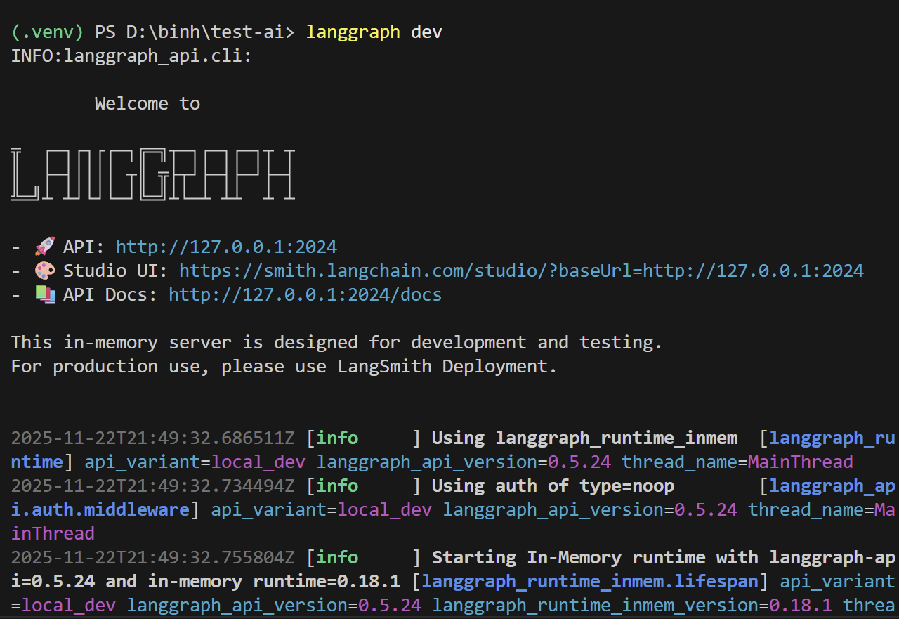
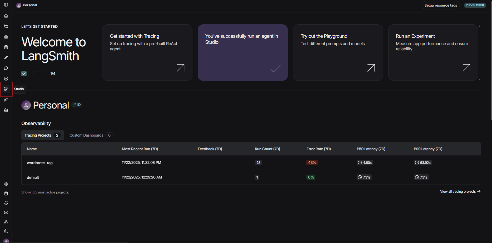
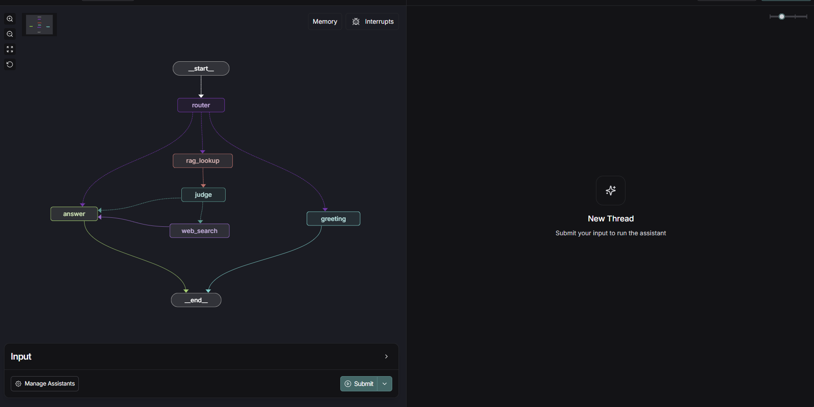

# LangGraph Studio Setup Guide

This guide walks you through setting up and accessing LangGraph Studio to visualize your agent's execution flow.

## Prerequisites

1. **Configure Environment Variables**
   - Ensure all required API keys are set in your `.env` file
   - See `.env.example` for reference

2. **Install Dependencies**
   - Follow the installation instructions in `README.md`
   - Make sure your virtual environment is activated

## Setup Steps

### 1. Install LangGraph CLI

Install the LangGraph CLI with the in-memory extras:

```bash
pip install -U "langgraph-cli[inmem]"
```

### 2. Start the Development Server

Run the LangGraph development server:

```bash
langgraph dev
```

### 3. Wait for Server Initialization

- The server will start on port `2024`
- Initial startup may take a few minutes on first run
- You should see output similar to:



### 4. Access LangGraph Studio

1. Navigate to [LangSmith](https://smith.langchain.com/)
2. Click the **Studio** button in the top navigation



### 5. Visualize Your Agent

You can now view your agent's execution flow in real-time through the Studio interface:



## Troubleshooting

If you cannot access the Studio interface, try these solutions:

### Browser Extensions
- Temporarily disable ad blockers (e.g., uBlock Origin, Privacy Badger)
- These extensions often block localhost requests

### Browser Compatibility
- Try a different browser (Chrome, Firefox, Edge)
- Use Incognito/Private mode to rule out extension conflicts

### Direct Server Access
Test if the server is running correctly by accessing the API docs directly:
```
http://127.0.0.1:2024/docs
```

If the Swagger UI loads, the server is working correctly and the issue is browser-related.